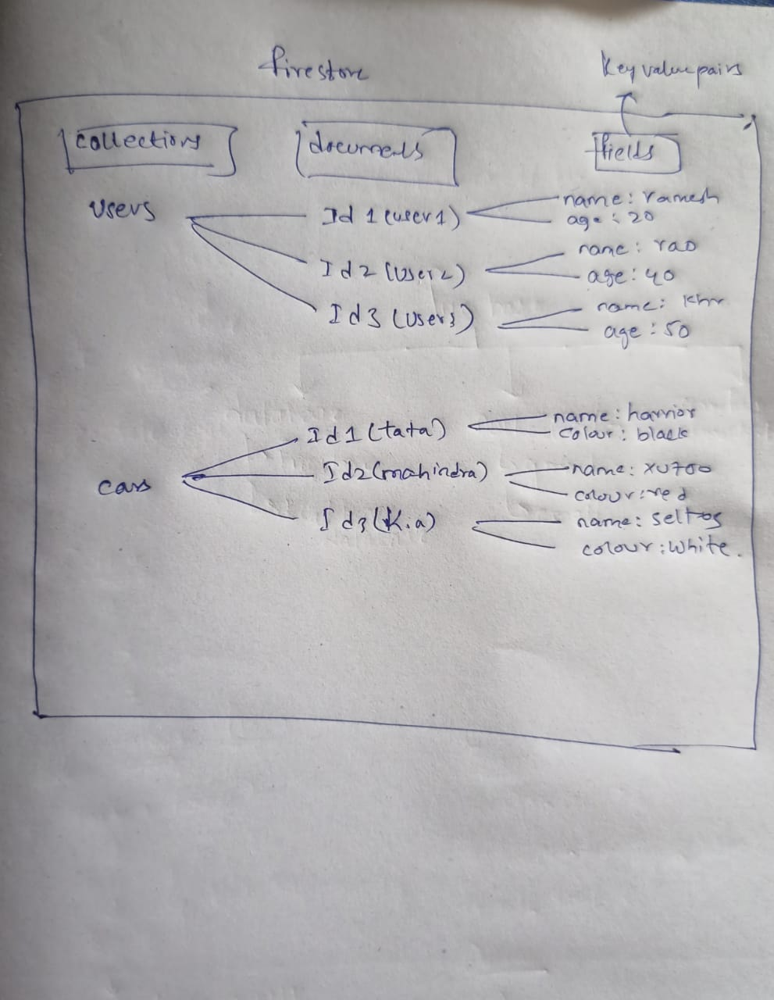

## Firestore
1. Cloud Firestore is a flexible (i.e, we can store any type of data), scalable(i.e, it can handle large amounts of data) NoSQL database from Firebase.

2. It is used to store and sync data in real time, and it's best for apps that need structured data with complex queries.

## Firestore Features
### data structure
1. The firestore stores data in `collection-document` model. 
    1. `collection`: its like a container that `holds multiple documents`.
    2. `document`: Each document is a `set of key-value` pairs called `fields`, and every document has a unique ID. 
    

### real time syncing
1. like real time database, firestore supports real-time data syncing.
2. Like when user updates data then the changes are instantly reflected in the data base & all connected users.

### allows advanced queries
1. firestore allows complex queries, filtering, sorting, and combining multiple conditions. 
2. you can retrieve data based on specific fields and conditions.
3. some of the query methods are 
    - `where()` – filter data

    - `orderBy()` – sort data

    - `limit()` – restrict number of results

### scalibility
1. Firestore is designed to scale easily, handling large amounts of data and traffic. 
2. It automatically handles things like indexing and sharding, which makes it suitable for both small and large applications.

### security
1. firestore uses Firebase Security Rules to control read and write access to documents and collections. You can set rules based on user authentication, data content, and more.