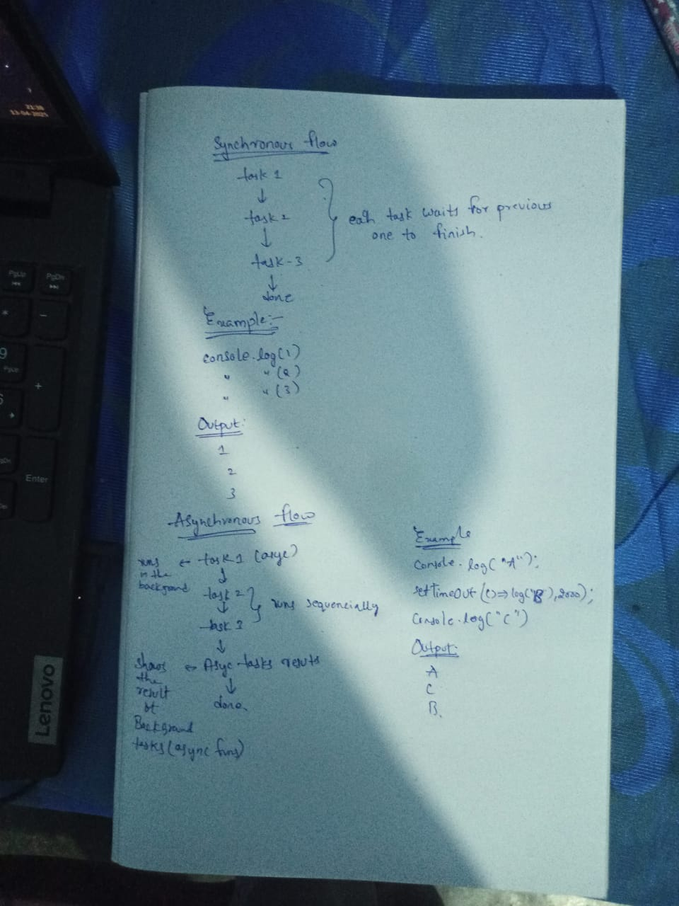

## Asynchronous Programming
1. Javascript excutes the tasks in `synchronus way by default`. i.e one after other, line by line.

2. if we have 3 functions: func1, func2, func3, and if func1 takes 500 seconds to finish, then func2 and func3 will have to wait for it to complete This slows down the program.

3. To `avoid delays`, JavaScript supports asynchronous programming, where long-running tasks (like func1) can run in the background. This allows the rest of the code (like func2 and func3) to keep running without waiting.

4. This improves performance and keeps apps responsive, especially for task like `fetching data from a server`.

### some of the inbuilt async functions available in JS.
#### `setTimeout()` & `setInterval()`:
1. these are the asynchoronous functions provided by the JS.
2. they don’t block the flow of code. They schedule a task to run later, while the rest of the code continues running. 

`setTimeOut(callback, delay) & clearTimeOut(id)`: 
1. `setTimeout()` `schedules a callback function` to run after a specified delay (in milliseconds).
2. It `returns a unique ID` that can be used to manage or cancel the time.
3. if you want `to cancel` the scheduled function before it runs, use `clearTimeout(id)` with the ID returned by setTimeout().
```JS
const id = setTimeout(() => {
  console.log("This will not run");
}, 3000);

clearTimeout(id); // cancels the setTimeout
```


`setInterval(callback, delay) & clearInterval(id)`:
1. setInterval() runs the callback function repeatedly at `every specified delay` (in milliseconds).
2. It also `returns a unique ID`.
3. To stop the repeated execution, use `clearInterval(id)` with the ID returned by setInterval().
```JS
const id = setInterval(() => {
  console.log("This runs every 2 seconds");
}, 2000);

clearInterval(id); // Stops the interval (if called later)
```
### synchronous programming vs asynchronous programing
1. In `synchronous programming`, the `code is executed sequentially`, line by line.

2. In `asynchronous programming`, the tasks (like API calls, timers, etc.) are taken out of the normal flow and `run in the background and their results are handled after all synchronous code` has finished executing.

3. If `multiple async taks are started` together, they `run concurrently in the background` i.e they dont block each other and they don't depend on the completion of other async tasks unless we explicitly chained them.


